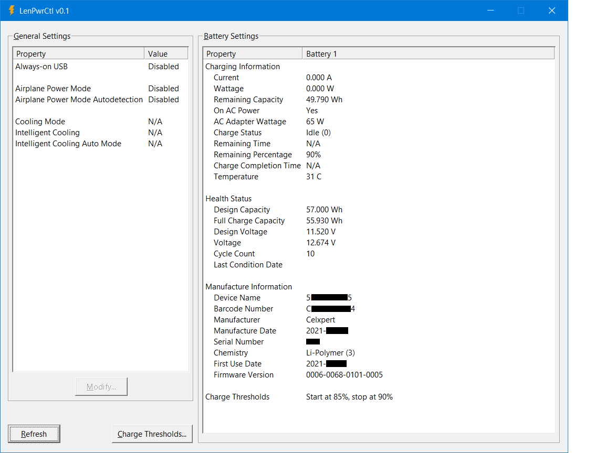
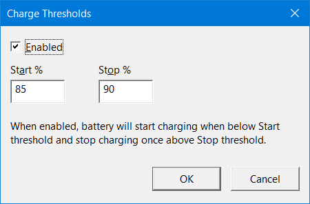
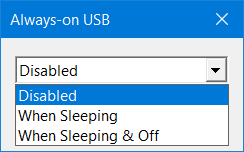

# LenPwrCtl - Monitor and control battery and power settings on Lenovo laptops

This tool shows several kinds of information regarding a laptop battery (batteries) and general power settings:
- Battery charging information, such as `Wattage (W)`, `Remaining Capacity (Wh)`, `AC Adapter Wattage (W)`, `Temperature (C)`.
- Battery health status, such as `Design Capacity (Wh)` and `Full Charge Capacity (Wh)`.
- Battery manufacture information, such as `Manufacturer`, `Manufacture Date`, `First Use Date`.
- Display and control Charge Thresholds - Start charging battery only when charge is below a set percentage,
  and stop charging when above a different percentage. This helps prolong battery life when battery is mostly connected to AC power.
- Display and control general power settings, such as `Always-on USB` and `Airplane Power Mode`.

## Download

Download `LenPwrCtl.exe` from the [Releases](https://github.com/alandau/LenPwrCtl/releases) page.

## Screenshots

## System Requirements

Tested on Windows 10 21H1 64-bit.

In theory it should work on previous versions of Windows 10 and on Windows 7 64-bit too, but this hasn't been tested.
If recompiled as a 32-bit executable, it should also work on 32-bit Windows versions.

## License

MIT
